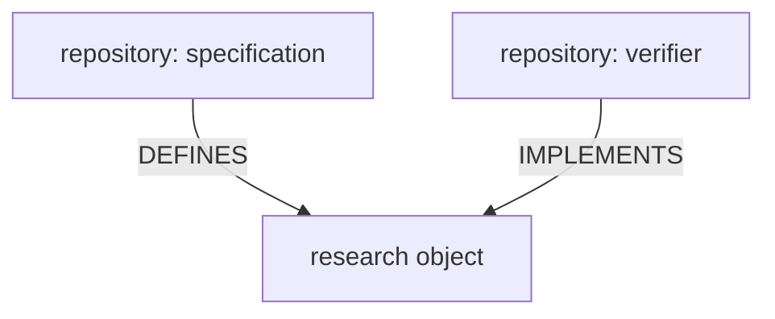
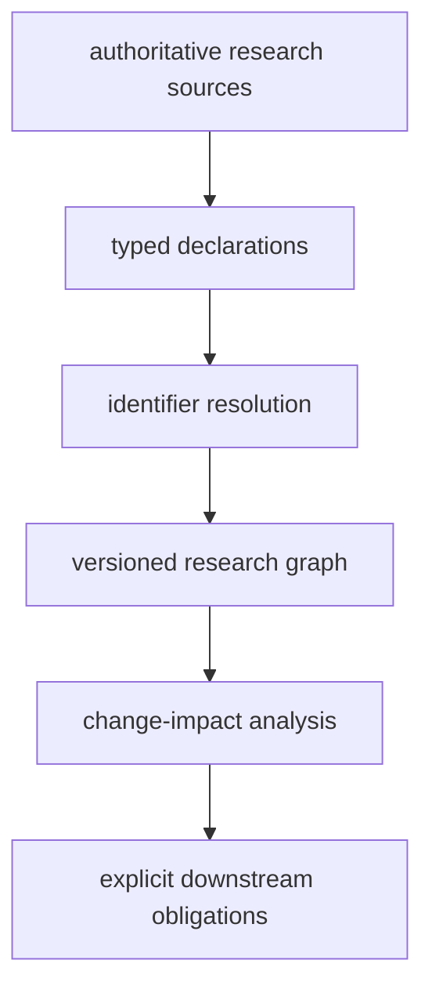

# Reactive Research

Reactive Research is a research coordination model in which
addressable research objects declare typed semantic relationships,
those relationships form a resolvable versioned graph,
and changes to graph objects generate explicit downstream
revalidation obligations.

The graph makes research relationships, provenance,
and the effects of change visible.

## Core Model

Research objects are first-class graph nodes.

For example:



Repository-to-repository relationships may be derived as projections
of the richer research-object graph.

## Typed Relationships

Reactive Research preserves the semantic meaning of relationships
rather than collapsing them into one ambiguous dependency list.

Source annotations use the `RR` namespace:

```text
RR.<RELATION>: <IDENTIFIER>
```

For example:

```text
RR.DEFINES: SE-210.Definition.4.3
RR.IMPLEMENTS: SE-210.Definition.4.3
```

The expanded `REACTIVE-RESEARCH` namespace is also supported.

The authoritative relationship vocabulary and semantics are defined by the
[Reactive Research specification](https://github.com/structural-explainability/reactive-research-spec).

## Research Coordination

Conceptually:



An affected downstream result is **not** automatically invalid.

It means its status relative to a changed upstream research object
may need to be established again.

Different relationship types may generate different obligations,
such as re-running, re-proving, re-reviewing, or reconsidering
downstream work.

## Command-Line API

The `reactive-research` package provides the reference executable
implementation.

See [API](api.md) for command-line usage and annotation syntax.

## Structured Research

Reactive Research is intended for structured research relationships generally.

### Science

```text
hypothesis
→ experimental design
→ dataset
→ analysis
→ evidence
→ claim
```

### Law

```text
constitution / statute / regulation
→ case
→ holding
→ interpretation
→ legal claim
→ decision
```

### Policy

```text
evidence
→ assumptions
→ policy analysis
→ recommendation
→ decision
→ evaluation
```

### Engineering

```text
requirement
→ design
→ implementation
→ verification
→ evidence
→ assurance claim
```

The graph does not decide what is true or what decision should be made.

It makes dependencies, provenance, and the effects of change visible.

## Structural Explainability Integration

Reactive Research originated within the Structural Explainability research
ecosystem but is intended to remain usable independently.

Within Structural Explainability, Reactive Research can compose declarations
from existing repository manifests, reference artifacts, formal contracts,
source annotations, and other compatible authoritative surfaces.

Existing tools remain authoritative for the surfaces they own.

Reactive Research resolves and composes those declarations into a broader
research graph rather than redefining them.

## Project Family

Reactive Research consists of:

- [reactive-research-spec](https://github.com/structural-explainability/reactive-research-spec) - normative model;
- [reactive-research-registry](https://github.com/structural-explainability/reactive-research-registry) - resolvable graph and snapshots; and
- [reactive-research](https://github.com/structural-explainability/reactive-research) - executable tooling.
