# Generated Research Views

These views are generated from the current Reactive Research observation of the
research family.

The Mermaid diagrams and structured JSON are generated from the same observed
research graph.

## Research Evolution

```mermaid
flowchart LR
  %% Typed arrows read source --relation--> target. Dependency impact follows reverse arrows; influence/protection follows forward arrows.
  n0["IR.DEF.IsCanonicalRegime [observed ]"]
  class n0 unresolved
  n1["IR.DEF.NonCollapsing [observed ]"]
  class n1 unresolved
  n2["IR.DEF.ProfileWellFormed [observed ]"]
  class n2 unresolved
  n3["IR.DEF.RegimeApplicationAdmissible [observed ]"]
  class n3 unresolved
  n4["IR.DEF.RequirementSatisfied [observed ]"]
  class n4 unresolved
  n5["IR.DEF.UnderSplitPressure [observed ]"]
  class n5 unresolved
  n6["IR.DEF.classificationMatrix [observed ]"]
  class n6 unresolved
  n7["IR.DEF.derivedRegimeSet [observed ]"]
  class n7 unresolved
  n8["IR.THEOREM.all_regimes_canonical [observed ]"]
  class n8 unresolved
  n9["IR.THEOREM.classification_pattern_unique [observed ]"]
  class n9 unresolved
  n10["IR.THEOREM.derivedRegimeSet_card [observed ]"]
  class n10 unresolved
  n11["IR.THEOREM.derivedRegimeSet_complete [observed ]"]
  class n11 unresolved
  n12["IR.THEOREM.derivedRegimeSet_nodup [observed ]"]
  class n12 unresolved
  n13["IR.THEOREM.derivedRegimeSet_pairwise_noncollapse [observed ]"]
  class n13 unresolved
  n14["IR.THEOREM.nine_regime_lower_bound [observed ]"]
  class n14 unresolved
  n15["IR.THEOREM.regime_application_admissible_of_neutral [observed ]"]
  class n15 unresolved
  n16["IR.TYPE.ClassificationValue [observed ]"]
  class n16 unresolved
  n17["IR.TYPE.IdentityBasis [observed ]"]
  class n17 unresolved
  n18["IR.TYPE.ProfileAxes [observed ]"]
  class n18 unresolved
  n19["IR.TYPE.Regime [observed ]"]
  class n19 unresolved
  n20["IR.TYPE.RegimeProfile [observed ]"]
  class n20 unresolved
  n21["IR.TYPE.RegimeProfileKind [observed ]"]
  class n21 unresolved
  n22["IR.TYPE.Requirement [observed ]"]
  class n22 unresolved
  n23["IR.TYPE.Transformation [observed ]"]
  class n23 unresolved
  n24["SE.PRED.Composable [observed ]"]
  class n24 unresolved
  n25["SE.PRED.Integrated [observed ]"]
  class n25 unresolved
  n26["SE.PRED.Traceable [observed ]"]
  class n26 unresolved
  n27["SE.THM.composable_of_neutral [observed ]"]
  class n27 unresolved
  n28["SE.THM.emptyOntology_neutral [observed ]"]
  class n28 unresolved
  n29["SE.THM.integrated_of_composable [observed ]"]
  class n29 unresolved
  n30["SE.THM.oblContext_composable [observed ]"]
  class n30 unresolved
  n31["SE.THM.oblContext_integrated [observed ]"]
  class n31 unresolved
  n32["SE.TYPE.SEContext [observed ]"]
  class n32 unresolved
  n33["SE.WIT.emptyOntology [observed ]"]
  class n33 unresolved
  n34["SE.WIT.oblContext [observed ]"]
  class n34 unresolved
  n35["SE.WIT.oblProfile [observed ]"]
  class n35 unresolved
  n36["SE300.DEF.CLASSIFICATION_MAP [observed ]"]
  class n36 unresolved
  n37["SE300.DEF.FAITHFUL_EMBEDDING [observed ]"]
  class n37 unresolved
  n38["SE300.DEF.REGIME_GRAPH [observed ]"]
  class n38 unresolved
  n39["SE300.DEF.TRANSFORMATION_FAMILY [observed ]"]
  class n39 unresolved
  n40["SE300.THM.NINE_PROFILE_LOWER_BOUND [observed ]"]
  class n40 unresolved
  n41["SE300.THM.REPRESENTATION [observed ]"]
  class n41 unresolved
  n42["se100.constraint.Neutrality [duplicate-definition ]"]
  class n42 ordinary
  n43["se100.def.NeutralityByDesign [duplicate-definition ]"]
  class n43 ordinary
  n44["se100.def.PermittedAttributionProposition [duplicate-definition ]"]
  class n44 ordinary
  n45["se100.def.ReferentialCommitments [duplicate-definition ]"]
  class n45 ordinary
  n46["se100.def.ReferentialRegime [duplicate-definition ]"]
  class n46 ordinary
  n47["se100.def.Substrate [duplicate-definition ]"]
  class n47 ordinary
  n48["paper-100-neutral-substrate [committed 402e0442] / commit 2026-10-02"]
  class n48 ordinary
  n49["se-pilot-identity-preservation-supply-chain-software [committed f9c676ba] / commit 2026-10-05"]
  class n49 ordinary
  n50["contracts/FREEZE_01_COMMITMENT_EVALUATOR.md [committed f9c676ba] / commit 2026-10-05"]
  class n50 protected
  n51["contracts/commitments.toml [committed f9c676ba] / commit 2026-10-05"]
  class n51 protected
  n52["contracts/schema.md [committed f9c676ba] / commit 2026-10-05"]
  class n52 protected
  n53["contracts/sources.toml [committed f9c676ba] / commit 2026-10-05"]
  class n53 protected
  n54["docs/en/run.md [committed f9c676ba] / commit 2026-10-05"]
  class n54 protected
  n55["src/preservation_test/evaluator/evaluate.py [committed f9c676ba] / commit 2026-10-05"]
  class n55 protected
  n56["src/preservation_test/evaluator/formats.py [committed f9c676ba] / commit 2026-10-05"]
  class n56 protected
  n57["src/preservation_test/evaluator/purl_canonical.py [committed f9c676ba] / commit 2026-10-05"]
  class n57 protected
  n58["se-verification-operational-identity [committed 647cedb1] / commit 2026-07-22"]
  class n58 ordinary
  n59["se-theory-identity-regimes [working e8daf211] / declared 0.3.1 / commit 2026-10-03"]
  class n59 ordinary
  n60["se-theory-interpretive-kernel [working ] / declared 0.4.0"]
  class n60 ordinary
  n61["se-theory-neutral-substrate [working c19bb76e] / declared 0.10.0 / commit 2026-10-03"]
  class n61 ordinary
  n62["se-theory-operational-identity [working ] / declared 0.4.0"]
  class n62 ordinary
  n63["se-theory-structural-explainability [working 6c1d88e9] / declared 0.3.0 / commit 2026-07-25"]
  class n63 ordinary
  n50 -->|"freezes / protection"| n51
  n50 -->|"freezes / protection"| n52
  n50 -->|"freezes / protection"| n53
  n50 -->|"freezes / protection"| n54
  n50 -->|"freezes / protection"| n55
  n50 -->|"freezes / protection"| n56
  n50 -->|"freezes / protection"| n57
  n58 -.->|"informs / context"| n49
  n59 -->|"implements / semantic / unresolved"| n36
  n59 -->|"implements / semantic / unresolved"| n37
  n59 -->|"implements / semantic / unresolved"| n38
  n59 -->|"implements / semantic / unresolved"| n39
  n59 -->|"implements / semantic / unresolved"| n40
  n59 -->|"implements / semantic / unresolved"| n41
  n60 -.->|"cites / semantic / unresolved"| n0
  n60 -.->|"cites / semantic / unresolved"| n1
  n60 -.->|"cites / semantic / unresolved"| n2
  n60 -.->|"cites / semantic / unresolved"| n3
  n60 -.->|"cites / semantic / unresolved"| n4
  n60 -.->|"cites / semantic / unresolved"| n5
  n60 -.->|"cites / semantic / unresolved"| n6
  n60 -.->|"cites / semantic / unresolved"| n7
  n60 -.->|"cites / semantic / unresolved"| n8
  n60 -.->|"cites / semantic / unresolved"| n9
  n60 -.->|"cites / semantic / unresolved"| n10
  n60 -.->|"cites / semantic / unresolved"| n11
  n60 -.->|"cites / semantic / unresolved"| n12
  n60 -.->|"cites / semantic / unresolved"| n13
  n60 -.->|"cites / semantic / unresolved"| n14
  n60 -.->|"cites / semantic / unresolved"| n15
  n60 -.->|"cites / semantic / unresolved"| n16
  n60 -.->|"cites / semantic / unresolved"| n17
  n60 -.->|"cites / semantic / unresolved"| n18
  n60 -.->|"cites / semantic / unresolved"| n19
  n60 -.->|"cites / semantic / unresolved"| n20
  n60 -.->|"cites / semantic / unresolved"| n21
  n60 -.->|"cites / semantic / unresolved"| n22
  n60 -.->|"cites / semantic / unresolved"| n23
  n61 -.->|"cites / semantic / duplicate-definition"| n42
  n61 -->|"formalizes / semantic / duplicate-definition"| n42
  n61 -->|"implements / semantic / duplicate-definition"| n42
  n61 -.->|"cites / semantic / duplicate-definition"| n43
  n61 -->|"formalizes / semantic / duplicate-definition"| n43
  n61 -->|"implements / semantic / duplicate-definition"| n43
  n61 -.->|"cites / semantic / duplicate-definition"| n44
  n61 -->|"formalizes / semantic / duplicate-definition"| n44
  n61 -->|"implements / semantic / duplicate-definition"| n44
  n61 -.->|"cites / semantic / duplicate-definition"| n45
  n61 -->|"formalizes / semantic / duplicate-definition"| n45
  n61 -->|"implements / semantic / duplicate-definition"| n45
  n61 -.->|"cites / semantic / duplicate-definition"| n46
  n61 -->|"formalizes / semantic / duplicate-definition"| n46
  n61 -->|"implements / semantic / duplicate-definition"| n46
  n61 -.->|"cites / semantic / duplicate-definition"| n47
  n61 -->|"formalizes / semantic / duplicate-definition"| n47
  n61 -->|"implements / semantic / duplicate-definition"| n47
  n61 -.->|"cites / semantic / 16 evidence edges"| n48
  n61 -->|"formalizes / semantic / 19 evidence edges"| n48
  n61 -->|"implements / semantic / 18 evidence edges"| n48
  n62 -.->|"cites / semantic / unresolved"| n0
  n62 -.->|"cites / semantic / unresolved"| n1
  n62 -.->|"cites / semantic / unresolved"| n2
  n62 -.->|"cites / semantic / unresolved"| n3
  n62 -.->|"cites / semantic / unresolved"| n4
  n62 -.->|"cites / semantic / unresolved"| n5
  n62 -.->|"cites / semantic / unresolved"| n6
  n62 -.->|"cites / semantic / unresolved"| n7
  n62 -.->|"cites / semantic / unresolved"| n8
  n62 -.->|"cites / semantic / unresolved"| n9
  n62 -.->|"cites / semantic / unresolved"| n10
  n62 -.->|"cites / semantic / unresolved"| n11
  n62 -.->|"cites / semantic / unresolved"| n12
  n62 -.->|"cites / semantic / unresolved"| n13
  n62 -.->|"cites / semantic / unresolved"| n14
  n62 -.->|"cites / semantic / unresolved"| n15
  n62 -.->|"cites / semantic / unresolved"| n16
  n62 -.->|"cites / semantic / unresolved"| n17
  n62 -.->|"cites / semantic / unresolved"| n18
  n62 -.->|"cites / semantic / unresolved"| n19
  n62 -.->|"cites / semantic / unresolved"| n20
  n62 -.->|"cites / semantic / unresolved"| n21
  n62 -.->|"cites / semantic / unresolved"| n22
  n62 -.->|"cites / semantic / unresolved"| n23
  n63 -.->|"cites / semantic / unresolved"| n24
  n63 -.->|"cites / semantic / unresolved"| n25
  n63 -.->|"cites / semantic / unresolved"| n26
  n63 -.->|"cites / semantic / unresolved"| n27
  n63 -.->|"cites / semantic / unresolved"| n28
  n63 -.->|"cites / semantic / unresolved"| n29
  n63 -.->|"cites / semantic / unresolved"| n30
  n63 -.->|"cites / semantic / unresolved"| n31
  n63 -.->|"cites / semantic / unresolved"| n32
  n63 -.->|"cites / semantic / unresolved"| n33
  n63 -.->|"cites / semantic / unresolved"| n34
  n63 -.->|"cites / semantic / unresolved"| n35
  classDef changed fill:#fde68a,stroke:#92400e,stroke-width:3px
  classDef protected fill:#fecaca,stroke:#991b1b,stroke-width:3px
  classDef mechanical fill:#bfdbfe,stroke:#1d4ed8
  classDef semantic fill:#e9d5ff,stroke:#7e22ce
  classDef verification fill:#bbf7d0,stroke:#166534
  classDef unresolved fill:#e5e7eb,stroke:#4b5563,stroke-dasharray:5 5
  classDef ordinary fill:#f8fafc,stroke:#64748b
```



Source: [evolution.mmd](evolution.mmd)

## Research Propagation

```mermaid
flowchart LR
  %% Typed arrows read source --relation--> target. Dependency impact follows reverse arrows; influence/protection follows forward arrows.
  n0["SE300.DEF.CLASSIFICATION_MAP [observed ]"]
  class n0 unresolved
  n1["SE300.DEF.FAITHFUL_EMBEDDING [observed ]"]
  class n1 unresolved
  n2["SE300.DEF.REGIME_GRAPH [observed ]"]
  class n2 unresolved
  n3["SE300.DEF.TRANSFORMATION_FAMILY [observed ]"]
  class n3 unresolved
  n4["SE300.THM.NINE_PROFILE_LOWER_BOUND [observed ]"]
  class n4 unresolved
  n5["SE300.THM.REPRESENTATION [observed ]"]
  class n5 unresolved
  n6["se100.constraint.Neutrality [duplicate-definition ]"]
  class n6 ordinary
  n7["se100.def.NeutralityByDesign [duplicate-definition ]"]
  class n7 ordinary
  n8["se100.def.PermittedAttributionProposition [duplicate-definition ]"]
  class n8 ordinary
  n9["se100.def.ReferentialCommitments [duplicate-definition ]"]
  class n9 ordinary
  n10["se100.def.ReferentialRegime [duplicate-definition ]"]
  class n10 ordinary
  n11["se100.def.Substrate [duplicate-definition ]"]
  class n11 ordinary
  n12["AccountableEntities [working 7cd1bc0f] / declared 0.2.0 / commit 2026-05-30"]
  class n12 ordinary
  n13["CEE [working f92de8ba] / declared 0.1.0 / commit 2026-05-30"]
  class n13 ordinary
  n14["EvolutionProtocol [working a8160f3d] / declared 0.1.0 / commit 2026-05-30"]
  class n14 ordinary
  n15["GovernanceBoundary [working c6973745] / declared 0.1.0 / commit 2026-05-30"]
  class n15 ordinary
  n16["InterpretationBoundary [working c529b583] / declared 0.1.0 / commit 2026-05-30"]
  class n16 ordinary
  n17["accountable-agents [working 44be6b69] / commit 2026-06-04"]
  class n17 ordinary
  n18["accountable-authority-vocabulary [working ]"]
  class n18 ordinary
  n19["accountable-evidence-vocabulary [working ]"]
  class n19 ordinary
  n20["accountable-review-vocabulary [working ]"]
  class n20 ordinary
  n21["accountable-surface-spec [working 4d1ae451] / commit 2026-06-03"]
  class n21 ordinary
  n22["accountable-surface-vocabulary [working ]"]
  class n22 ordinary
  n23["agent-capability-mappings [working cf98fca3] / commit 2026-06-04"]
  class n23 ordinary
  n24["agent-capability-registry [working 1047fa13] / commit 2026-06-04"]
  class n24 ordinary
  n25["paper-210-operational-identity [working ]"]
  class n25 ordinary
  n26["paper-100-neutral-substrate [committed 402e0442] / commit 2026-10-02"]
  class n26 ordinary
  n27["paper-200-identity-regimes [working 2f74cf92] / commit 2026-07-30"]
  class n27 ordinary
  n28["paper-210-operational-identity [committed 191c3f3c] / commit 2026-09-19"]
  class n28 ordinary
  n29["paper-220-interpretive-kernel [working 450a0382] / commit 2026-07-22"]
  class n29 ordinary
  n30["reactive-research [working cd3525b2] / commit 2026-09-30"]
  class n30 ordinary
  n31["reactive-research-registry [committed c6f477c0] / commit 2026-09-30"]
  class n31 ordinary
  n32["reactive-research-spec [committed 2ab3a269] / commit 2026-09-30"]
  class n32 ordinary
  n33["accountable-record [working bdebfedb] / commit 2026-05-26"]
  class n33 ordinary
  n34["accountable-record-py [working bee8c0bd] / commit 2026-05-29"]
  class n34 ordinary
  n35["accountable-record-spec [working 220adfd8] / commit 2026-05-16"]
  class n35 ordinary
  n36["civic-influence-record-spec [working 3633b634] / commit 2026-05-16"]
  class n36 ordinary
  n37["judicial-record-spec [working d70728d2] / commit 2026-05-16"]
  class n37 ordinary
  n38["se-contract-kit [working 1585b763] / commit 2026-05-24"]
  class n38 ordinary
  n39["se-verification-civic-influence-record [working ]"]
  class n39 ordinary
  n40["se-verification-judicial-record [working 5a3453c0] / commit 2026-05-17"]
  class n40 ordinary
  n41["schedule-spec [working ]"]
  class n41 ordinary
  n42["scheduling-semantic-substrate [working ] / declared 0.1.0"]
  class n42 ordinary
  n43["se-admin [working a847977d] / commit 2026-05-30"]
  class n43 ordinary
  n44["se-codeowners [working 8d8f8215] / commit 2026-06-06"]
  class n44 ordinary
  n45["se-constitution [working c9b21b53] / commit 2026-05-30"]
  class n45 ordinary
  n46["paper-210-operational-identity [working ]"]
  class n46 ordinary
  n47["se-df [committed 5749fd46] / commit 2026-07-19"]
  class n47 ordinary
  n48["se-formal-contract [working a93c2eea] / declared 0.2.0 / commit 2026-05-30"]
  class n48 ordinary
  n49["se-kernel [working 35ec2790] / commit 2026-05-30"]
  class n49 ordinary
  n50["se-manifest-schema [committed 64f9405c] / commit 2026-07-22"]
  class n50 ordinary
  n51["se-mapping-assurance [committed c36aef2c] / commit 2026-09-29"]
  class n51 ordinary
  n52["se-mapping-education [working a20e2a67] / commit 2026-05-30"]
  class n52 ordinary
  n53["se-mapping-education-math [working 0de39d36] / commit 2026-05-30"]
  class n53 ordinary
  n54["se-mapping-education-math-g8 [working 81c14e10] / commit 2026-05-30"]
  class n54 ordinary
  n55["se-mapspec [committed 3af0b381] / commit 2026-09-29"]
  class n55 ordinary
  n56["se-pilot-identity-preservation-supply-chain-software [committed f9c676ba] / commit 2026-10-05"]
  class n56 ordinary
  n57["contracts/FREEZE_01_COMMITMENT_EVALUATOR.md [committed f9c676ba] / commit 2026-10-05"]
  class n57 protected
  n58["contracts/commitments.toml [committed f9c676ba] / commit 2026-10-05"]
  class n58 protected
  n59["contracts/schema.md [committed f9c676ba] / commit 2026-10-05"]
  class n59 protected
  n60["contracts/sources.toml [committed f9c676ba] / commit 2026-10-05"]
  class n60 protected
  n61["docs/en/run.md [committed f9c676ba] / commit 2026-10-05"]
  class n61 protected
  n62["src/preservation_test/evaluator/evaluate.py [committed f9c676ba] / commit 2026-10-05"]
  class n62 protected
  n63["src/preservation_test/evaluator/formats.py [committed f9c676ba] / commit 2026-10-05"]
  class n63 protected
  n64["src/preservation_test/evaluator/purl_canonical.py [committed f9c676ba] / commit 2026-10-05"]
  class n64 protected
  n65["se-regimes [working a793eed6] / commit 2026-05-30"]
  class n65 ordinary
  n66["se-regimes-pilot-education-math-g8 [working 8079051d] / commit 2026-05-30"]
  class n66 ordinary
  n67["se-verification-operational-identity [committed 647cedb1] / commit 2026-07-22"]
  class n67 ordinary
  n68["se-verification-vulnerability-matching [working d1d92240] / commit 2026-09-19"]
  class n68 ordinary
  n69["spec-ae [working b56d238d] / commit 2026-05-30"]
  class n69 ordinary
  n70["spec-cee [working 5a95c9a0] / commit 2026-05-30"]
  class n70 ordinary
  n71["spec-ep [working 451ac669] / commit 2026-05-30"]
  class n71 ordinary
  n72["spec-gb [working 71f89a00] / commit 2026-05-30"]
  class n72 ordinary
  n73["spec-ib [working 68d7fd1c] / commit 2026-05-15"]
  class n73 ordinary
  n74["spec-se [working 1bbf92f5] / commit 2026-01-23"]
  class n74 ordinary
  n75["spec-se-appendix [working 28f47b67] / commit 2026-05-30"]
  class n75 ordinary
  n76["se-theory-identity-regimes [working e8daf211] / declared 0.3.1 / commit 2026-10-03"]
  class n76 ordinary
  n77["se-theory-interpretive-kernel [working ] / declared 0.4.0"]
  class n77 ordinary
  n78["se-theory-neutral-substrate [working c19bb76e] / declared 0.10.0 / commit 2026-10-03"]
  class n78 ordinary
  n79["se-theory-operational-identity [working ] / declared 0.4.0"]
  class n79 ordinary
  n80["se-theory-persistence [working 00faac87] / declared 0.1.0 / commit 2026-10-03"]
  class n80 ordinary
  n81["se-theory-structural-assurability [working 98ab4cb7] / declared 0.3.1 / commit 2026-09-29"]
  class n81 ordinary
  n82["se-theory-structural-explainability [working 6c1d88e9] / declared 0.3.0 / commit 2026-07-25"]
  class n82 ordinary
  n83["se-theory-transformation [working 350c7ff0] / declared 0.5.1 / commit 2026-10-05"]
  class n83 ordinary
  n84["paper-300-accountable-records [working 82d2f887] / commit 2026-07-11"]
  class n84 ordinary
  n85["PyYAML [observed ]"]
  class n85 unresolved
  n86["SETheoryIdentityRegimes [observed ]"]
  class n86 unresolved
  n87["jsonschema [observed ]"]
  class n87 unresolved
  n88["mathlib [observed ]"]
  class n88 unresolved
  n89["packageurl-python [observed ]"]
  class n89 unresolved
  n90["purl_canonical [observed ]"]
  class n90 unresolved
  n91["se-verification-operational-identity==0.1.0 [observed ]"]
  class n91 unresolved
  n92["structural-explainability/accountable-agents@main [observed ]"]
  class n92 unresolved
  n93["structural-explainability/accountable-authority-vocabulary@main [observed ]"]
  class n93 unresolved
  n94["structural-explainability/accountable-evidence-vocabulary@main [observed ]"]
  class n94 unresolved
  n95["structural-explainability/accountable-review-vocabulary@main [observed ]"]
  class n95 unresolved
  n96["structural-explainability/accountable-surface-vocabulary@main [observed ]"]
  class n96 unresolved
  n97["structural-explainability/agent-capability-mappings@main [observed ]"]
  class n97 unresolved
  n98["structural-explainability/agent-capability-registry@main [observed ]"]
  class n98 unresolved
  n99["tomli-w [observed ]"]
  class n99 unresolved
  n100["tomlkit [observed ]"]
  class n100 unresolved
  n101["typer [observed ]"]
  class n101 unresolved
  n12 -->|"depends-on / semantic / v1"| n69
  n12 -->|"depends-on / semantic / v1"| n74
  n12 -->|"depends-on / semantic / v1"| n76
  n12 -->|"depends-on / build / main / unresolved"| n86
  n13 -->|"depends-on / build / main"| n12
  n13 -->|"depends-on / build / main"| n14
  n13 -->|"depends-on / semantic / v1"| n69
  n13 -->|"depends-on / semantic / v1"| n70
  n13 -->|"depends-on / semantic / v1"| n71
  n13 -->|"depends-on / semantic / v1"| n74
  n14 -->|"depends-on / build / main"| n12
  n14 -->|"depends-on / semantic / v1"| n69
  n14 -->|"depends-on / semantic / v1"| n71
  n14 -->|"depends-on / semantic / v1"| n74
  n15 -->|"depends-on / semantic / v1"| n72
  n15 -->|"depends-on / semantic / v1"| n74
  n16 -->|"depends-on / semantic / v1"| n73
  n16 -->|"depends-on / semantic / v1"| n74
  n17 -->|"depends-on / semantic / unresolved"| n93
  n17 -->|"depends-on / semantic / unresolved"| n94
  n17 -->|"depends-on / semantic / unresolved"| n95
  n17 -->|"depends-on / semantic / unresolved"| n96
  n17 -->|"depends-on / semantic / unresolved"| n97
  n17 -->|"depends-on / semantic / unresolved"| n98
  n21 -->|"depends-on / semantic / main"| n18
  n21 -->|"depends-on / semantic / main"| n19
  n21 -->|"depends-on / semantic / main"| n20
  n21 -->|"depends-on / semantic / main"| n22
  n23 -->|"depends-on / semantic / unresolved"| n92
  n23 -->|"depends-on / semantic / unresolved"| n98
  n24 -->|"depends-on / semantic / unresolved"| n92
  n24 -->|"depends-on / semantic / unresolved"| n94
  n24 -->|"depends-on / semantic / unresolved"| n95
  n24 -->|"depends-on / semantic / unresolved"| n96
  n25 -->|"depends-on / semantic"| n26
  n25 -->|"depends-on / semantic"| n27
  n27 -->|"depends-on / semantic"| n26
  n28 -->|"depends-on / semantic"| n26
  n28 -->|"depends-on / semantic"| n27
  n29 -->|"depends-on / semantic"| n26
  n29 -->|"depends-on / semantic"| n27
  n30 -->|"depends-on / semantic / main"| n31
  n30 -->|"depends-on / semantic / main"| n32
  n30 -->|"depends-on / tooling / main"| n50
  n33 -->|"depends-on / build"| n38
  n33 -->|"depends-on / build"| n50
  n33 -->|"depends-on / semantic / v0.5.0"| n50
  n34 -->|"depends-on / build"| n38
  n34 -->|"depends-on / semantic / main"| n38
  n34 -->|"depends-on / semantic / main"| n48
  n34 -->|"depends-on / build"| n50
  n34 -->|"depends-on / semantic / main"| n50
  n34 -->|"depends-on / semantic / main"| n76
  n35 -->|"depends-on / semantic / main"| n69
  n35 -->|"depends-on / semantic / main"| n70
  n35 -->|"depends-on / semantic / main"| n71
  n35 -->|"depends-on / semantic / main"| n72
  n35 -->|"depends-on / semantic / main"| n73
  n35 -->|"depends-on / semantic / main"| n74
  n36 -->|"depends-on / semantic / main"| n33
  n36 -->|"depends-on / semantic / main"| n39
  n37 -->|"depends-on / semantic / main"| n33
  n37 -->|"depends-on / semantic / main"| n40
  n38 -->|"depends-on / build"| n50
  n38 -->|"depends-on / tooling / v0.4.1"| n50
  n39 -->|"depends-on / semantic / main"| n33
  n39 -->|"depends-on / build"| n35
  n39 -->|"depends-on / semantic / main"| n36
  n39 -->|"depends-on / semantic / main"| n69
  n39 -->|"depends-on / semantic / main"| n70
  n39 -->|"depends-on / semantic / main"| n71
  n39 -->|"depends-on / semantic / main"| n72
  n39 -->|"depends-on / semantic / main"| n73
  n39 -->|"depends-on / semantic / main"| n74
  n40 -->|"depends-on / semantic / main"| n35
  n40 -->|"depends-on / semantic / main"| n37
  n40 -->|"depends-on / semantic / main"| n69
  n40 -->|"depends-on / semantic / main"| n70
  n40 -->|"depends-on / semantic / main"| n71
  n40 -->|"depends-on / semantic / main"| n72
  n40 -->|"depends-on / semantic / main"| n73
  n40 -->|"depends-on / semantic / main"| n74
  n41 -->|"depends-on / build / unresolved"| n85
  n41 -->|"depends-on / build / unresolved"| n87
  n42 -->|"depends-on / build / unresolved"| n85
  n42 -->|"depends-on / build / unresolved"| n87
  n42 -->|"depends-on / build / unresolved"| n101
  n43 -->|"depends-on / semantic / main"| n45
  n43 -->|"depends-on / build"| n50
  n43 -->|"depends-on / build / unresolved"| n100
  n44 -->|"depends-on / tooling / v0.4.1"| n50
  n45 -->|"depends-on / semantic"| n48
  n45 -->|"depends-on / build"| n50
  n46 -->|"depends-on / semantic"| n26
  n46 -->|"depends-on / semantic"| n27
  n47 -->|"depends-on / build / unresolved"| n85
  n47 -->|"depends-on / build / unresolved"| n87
  n48 -->|"depends-on / build"| n50
  n48 -->|"depends-on / semantic"| n76
  n48 -->|"depends-on / semantic"| n78
  n48 -->|"depends-on / semantic"| n82
  n48 -->|"depends-on / build / unresolved"| n100
  n50 -->|"depends-on / tooling / main"| n38
  n51 -->|"depends-on / build"| n55
  n51 -->|"depends-on / semantic"| n55
  n52 -->|"depends-on / semantic / main"| n45
  n52 -->|"depends-on / build / unresolved"| n99
  n53 -->|"depends-on / semantic / main"| n45
  n53 -->|"depends-on / build"| n52
  n53 -->|"depends-on / semantic / main"| n54
  n53 -->|"depends-on / build / unresolved"| n99
  n54 -->|"depends-on / semantic / main"| n45
  n54 -->|"depends-on / build"| n52
  n54 -->|"depends-on / build"| n53
  n54 -->|"depends-on / build"| n65
  n54 -->|"depends-on / build / unresolved"| n99
  n55 -->|"depends-on / semantic / main"| n45
  n55 -->|"depends-on / semantic / main"| n49
  n56 -->|"depends-on / build / unresolved"| n89
  n57 -->|"freezes / protection"| n58
  n57 -->|"freezes / protection"| n59
  n57 -->|"freezes / protection"| n60
  n57 -->|"freezes / protection"| n61
  n57 -->|"freezes / protection"| n62
  n57 -->|"freezes / protection"| n63
  n57 -->|"freezes / protection"| n64
  n65 -->|"depends-on / semantic / main"| n49
  n66 -->|"depends-on / build"| n65
  n68 -->|"depends-on / build"| n67
  n68 -->|"depends-on / build / unresolved"| n90
  n68 -->|"depends-on / semantic / unresolved"| n91
  n69 -->|"depends-on / semantic / v1"| n74
  n70 -->|"depends-on / semantic / v1"| n69
  n70 -->|"depends-on / semantic / v1"| n71
  n70 -->|"depends-on / semantic / v1"| n74
  n71 -->|"depends-on / semantic / v1"| n74
  n72 -->|"depends-on / semantic / v1"| n74
  n73 -->|"depends-on / semantic / v1"| n74
  n75 -->|"depends-on / semantic / v1"| n74
  n76 -->|"implements / semantic / unresolved"| n0
  n76 -->|"implements / semantic / unresolved"| n1
  n76 -->|"implements / semantic / unresolved"| n2
  n76 -->|"implements / semantic / unresolved"| n3
  n76 -->|"implements / semantic / unresolved"| n4
  n76 -->|"implements / semantic / unresolved"| n5
  n76 -->|"depends-on / build / main"| n78
  n76 -->|"depends-on / semantic"| n78
  n76 -->|"depends-on / build / v0.5.1"| n83
  n77 -->|"depends-on / build / main"| n78
  n77 -->|"depends-on / semantic"| n78
  n77 -->|"depends-on / build / v0.5.1"| n83
  n78 -->|"formalizes / semantic / duplicate-definition"| n6
  n78 -->|"implements / semantic / duplicate-definition"| n6
  n78 -->|"formalizes / semantic / duplicate-definition"| n7
  n78 -->|"implements / semantic / duplicate-definition"| n7
  n78 -->|"formalizes / semantic / duplicate-definition"| n8
  n78 -->|"implements / semantic / duplicate-definition"| n8
  n78 -->|"formalizes / semantic / duplicate-definition"| n9
  n78 -->|"implements / semantic / duplicate-definition"| n9
  n78 -->|"formalizes / semantic / duplicate-definition"| n10
  n78 -->|"implements / semantic / duplicate-definition"| n10
  n78 -->|"formalizes / semantic / duplicate-definition"| n11
  n78 -->|"implements / semantic / duplicate-definition"| n11
  n78 -->|"formalizes / semantic / 19 evidence edges"| n26
  n78 -->|"implements / semantic / 18 evidence edges"| n26
  n78 -->|"depends-on / build / v4.34.0 / unresolved"| n88
  n79 -->|"depends-on / build / main"| n78
  n79 -->|"depends-on / semantic"| n78
  n79 -->|"depends-on / build / v0.5.1"| n83
  n80 -->|"depends-on / build / v0.5.1"| n83
  n80 -->|"depends-on / semantic / main"| n83
  n80 -->|"depends-on / build / v4.34.0 / unresolved"| n88
  n81 -->|"depends-on / build / v4.34.0 / unresolved"| n88
  n82 -->|"depends-on / build / main"| n76
  n82 -->|"depends-on / semantic"| n76
  n82 -->|"depends-on / build / main"| n78
  n82 -->|"depends-on / semantic"| n78
  n83 -->|"depends-on / build / v4.34.0 / unresolved"| n88
  n84 -->|"depends-on / semantic"| n26
  n84 -->|"depends-on / semantic"| n27
  classDef changed fill:#fde68a,stroke:#92400e,stroke-width:3px
  classDef protected fill:#fecaca,stroke:#991b1b,stroke-width:3px
  classDef mechanical fill:#bfdbfe,stroke:#1d4ed8
  classDef semantic fill:#e9d5ff,stroke:#7e22ce
  classDef verification fill:#bbf7d0,stroke:#166534
  classDef unresolved fill:#e5e7eb,stroke:#4b5563,stroke-dasharray:5 5
  classDef ordinary fill:#f8fafc,stroke:#64748b
```

Source: [propagation.mmd](propagation.mmd)

## Structured Data

- [Full observation](observation.json)
- [Repository graph](repository-graph.json)

Regenerate these artifacts from the `reactive-research` repository root:

```powershell
uv run reactive-research generate --root .. --output docs/en/output
```
