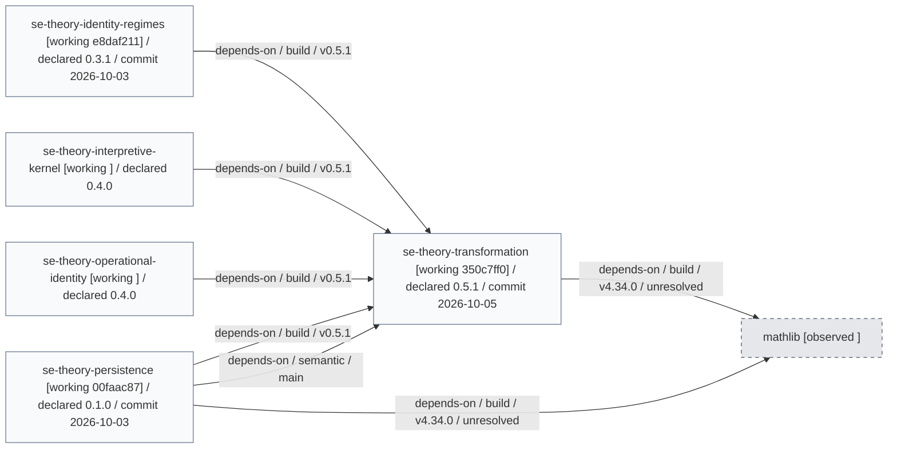
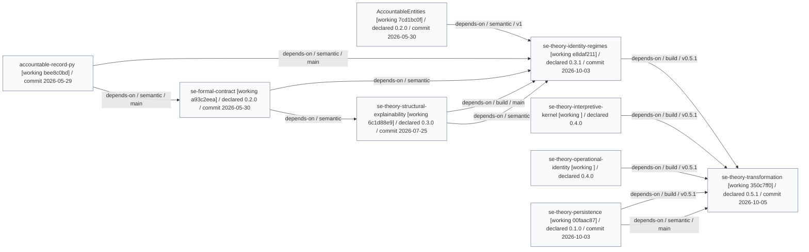

# Generated Research Views

These views are generated from the current Reactive Research observation of the
research family.

The full detailed research graphs and structured observation are retained.
The smaller views below provide focused entry points for inspection.

## Transformation Neighborhood

This diagram depicts the repositories directly connected to
`se-theory-transformation` in the current Reactive Research observation.

Reactive Research first observes supported relationship evidence across the
research family and builds a repository-level graph.
The evidence may come from sources such as repository declarations,
dependency information, formalization references, and Reactive Research annotations.

For this view, the generator selects `se-theory-transformation` and every
repository connected to it by one recorded relationship in either direction.
All recorded relationship types are eligible for this view.

The diagram therefore shows the immediate context around Transformation:
which repositories are directly related to it and the type of each recorded
relationship.

Only one level of connections is included.
Relationships beyond direct neighbors are not included.



Generated artifacts:

- [Transformation neighborhood Mermaid](transformation-neighborhood.mmd)
- [Transformation neighborhood JSON](transformation-neighborhood.json)

## Transformation Downstream

This diagram depicts repositories that rely on
`se-theory-transformation`, either directly or through another repository.

It is generated from the same repository-level graph as the Transformation
Neighborhood view, but it selects only relationships that indicate downstream
use or dependency.

The included relationship types are:

- `depends-on`
- `implements`
- `formalizes`
- `specifies`
- `tests`
- `pilots`
- `evaluates`
- `derives-from`

The first level contains repositories with one of these recorded relationships
to Transformation.

The second level contains repositories with one of these relationships to a
repository in the first level.

The traversal stops after two levels to keep the diagram limited in scope.

Unlike the Transformation Neighborhood view, this diagram does not include
every recorded relationship around Transformation.
It depicts only the selected relationships
used to trace **downstream reliance**.



Generated artifacts:

- [Transformation downstream Mermaid](transformation-downstream.mmd)
- [Transformation downstream JSON](transformation-downstream.json)

## Full Detailed Research Graphs

The complete drawings are retained for detailed inspection.

- [Full research evolution](evolution.mmd)
- [Full research propagation](propagation.mmd)

## Full Structured Research Data

- [Full observation](observation.json)
- [Repository graph](repository-graph.json)

Regenerate these artifacts from the `reactive-research` repository root:

```powershell
uv run reactive-research generate --root .. --output docs/en/output
```
